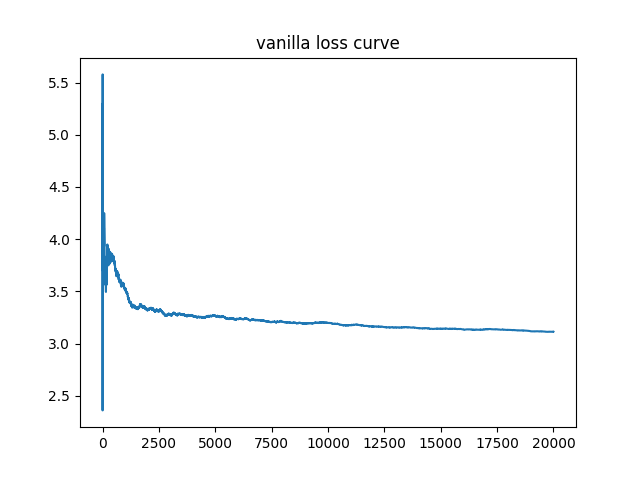
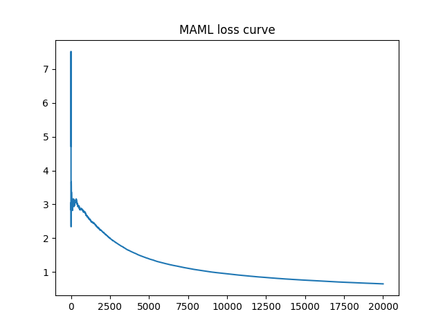
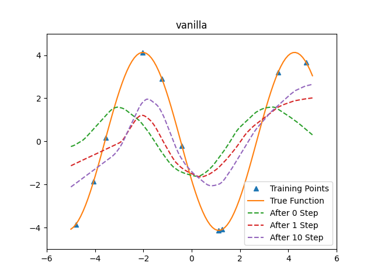
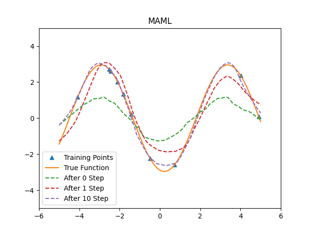

# Model Agnostic Meta Learning

Reproduce of [MAML](https://arxiv.org/pdf/1703.03400.pdf) paper in toy example regression task (Sinusoid) using TensorFlow 2.1.

The loss curve comparison between a normal deep learning method and MAML:



An inference example of random new task trained with only 10 steps:



### How to use:
- Build Docker image from Dockerfile
- Run ```python main.py``` to perform vanilla and MAML experiments
